# Distribution — one repository, two owners

An instance of the OS **is a clone of this repository**. The framework and the instance
share one git history and own **disjoint paths**: the framework's folders arrive and
update by merge, the instance's folders are instantiated once on first run and never
touched by the framework again. Setting up is one clone and one script; updating is one
script. This note is the standing answer to how an instance consumes the framework, why
the separation that used to be two repositories now runs *inside* one, and what each
side may and may not do.

## The invariant

The privacy boundary is structural, not procedural. It used to be "two git histories";
it is now **two path sets with one owner each, enforced by a gate**:

| Owner | Paths | Who writes | How it changes |
|-------|-------|-----------|----------------|
| **Framework** (public) | `CLAUDE.md` · `README.md` · `LICENSE` · `PROVENANCE.md` · `SECURITY.md` · `skills/` · `systems/` · `templates/` · `agents/` · `hooks/` · `pipeline/` · `scripts/` · `tests/` · `instance-template/` · `.github/` · `.githooks/` · `.gitignore` | upstream, by pull request in a public checkout | `scripts/upgrade.sh` merges the framework's `main` |
| **Instance** (private) | everything `instance-template/root/` carries, at the same paths: `.claude/CLAUDE.md` · `_index.md` · `projects/` · `memory/` · `automations/` · `vaults/` · `meta-os.config.json` · `.packs.yaml` · `.obsidian/` · the extension points `.githooks.d/` and `.gitignore.instance` — plus the pack mounts `.packs/` and `.gitmodules`, and anything else the instance adds | the instance, directly | never by the framework |

Two rules keep the sets disjoint, and both are checked by a program rather than by care:

1. **The framework never tracks an instance path.** `scripts/validate_framework.py`
   derives the instance paths from `instance-template/root/` and fails — never as
   tolerated debt — on any tracked file at one of them. So a framework merge cannot
   carry a change to an instance file, because no framework commit contains one.
2. **An instance never edits a framework path.** `scripts/upgrade.sh` lists the
   framework paths the instance modified or deleted since the merge base and refuses
   to merge while there are any (`--force` to carry them and resolve the result
   yourself). Adding a path anywhere is fine — the instance's own skill in `skills/`, its own note type in `systems/`, its own workflow in `.github/workflows/`, a top-level folder of its own; only the framework's files are off limits. Inside an instance — a checkout that *commits* `.claude/CLAUDE.md` — the gate judges exactly the framework's files: the paths the framework tracks at the commit last merged (the merge base with `upstream/main`, or `$META_OS_FRAMEWORK_REF`; the gate prints which commit), so an instance addition is never a public-safety or folder-index finding. A framework developer's checkout (`bootstrap.sh --local`, contract on disk but excluded) keeps the full scope, so a file added on a branch is checked before it is pushed.

What the instance contract and the framework contract are is unchanged: the root
`CLAUDE.md` is the framework's (what the OS *is*), `.claude/CLAUDE.md` is the
instance's (what *this estate* is). Claude Code loads both as project instructions, so
no composition step and no symlink stands between a framework rule and the session
that must follow it.

## First run

```bash
git clone https://github.com/meta-agentic/meta-os.git my-os && cd my-os
scripts/bootstrap.sh            # interactive on a terminal; --yes takes every default
```

`scripts/bootstrap.sh` does five things, each idempotent and each reported:

1. **Instantiates** `instance-template/root/` at the repository root — path for path,
   only where the path does not exist yet — and fills the placeholders
   (`{{instance-name}}`, `{{bootstrapped}}`, `{{template-ref}}`) in the copies.
   [[instance-template/_index|instance-template/]] documents the payload.
2. **Points the remotes the right way round.** The clone's `origin` is the public
   framework, so it becomes `upstream` with its push URL set to `no_push`: the
   framework is fetched, never pushed to, and a wrong `git push` fails instead of
   leaking an estate. Your private remote is added as `origin` (`--origin <url>`, or
   later by hand).
3. **Mounts packs** (`--packs agile,…` from [[systems/packs.yaml|the registry]]) and
   **builds the discovery links**: pack skills linked into `skills/` beside the
   framework's own, the whole of `skills/` mirrored into `.claude/skills/`. Generated,
   never committed — `scripts/packs.sh sync` lists its links in `.git/info/exclude`,
   the framework's `.gitignore` covers `.claude/{skills,agents,hooks}/`.
4. **Installs the dashboard** if asked (`--dashboard [dir]`): clones
   [meta-os-dashboard](https://github.com/meta-agentic/meta-os-dashboard) next to the
   repository and writes its `instance.config.json` pointing here — the app keeps its
   own repository and lifecycle (Node dependencies, build, CI), the instance just
   gets it wired on first run.
5. **Commits** (`--commit`) or tells you the command.

Headless installs pass every answer as a flag (`--yes --name acme --packs agile
--origin git@…`); `--dry-run` prints the plan and writes nothing. The guided first
conversation — backlog model, first project, GitHub wiring — stays with the
[[skills/bootstrap-instance/SKILL|bootstrap-instance]] skill, which calls this script
for the mechanical part.

## Updating

```bash
scripts/upgrade.sh --check      # how far behind, integrity, template drift — changes nothing
scripts/upgrade.sh              # fetch upstream, verify, merge, re-sync the links
```

The merge touches framework paths only (rule 1). After it, `scripts/packs.sh sync`
rebuilds the links so a skill the framework added is discoverable at once, and the
framework's own gate runs scoped to the framework's paths.

**The template is reported, not re-applied.** An instance's `_index.md`, `projects/`,
`automations/` are its own from the moment they were instantiated; a later change to
`instance-template/root/` is shown as a diff since the `template` ref recorded in
`meta-os.config.json`, for the operator to apply by hand or ignore, then
`--ack-template` records the reviewed ref. A change that must reach *running*
instances is framework mechanism and belongs in `skills/`, `systems/`, `scripts/` or
`hooks/` — never in the template.

**A repository created from a template snapshot** (GitHub's *Use this template*, or a copied tree) has no history in common with the framework. The first upgrade merges with `--allow-unrelated-histories`; every conflict it can meet is a framework path the framework itself changed since the snapshot (rule 2 was checked first), so each is resolved to the framework's version — including a symlink or a file where the framework has a folder, which git reports under a parked name (`<path>~HEAD`). From then on there is a merge base and upgrades are ordinary merges. A repository that was an instance before it had the framework at all is *adopted* instead (below).

## Extension points

Rule 2 forbids editing a framework file, and two framework files are ones an instance used to edit: the git hooks in `.githooks/` and the root `.gitignore`. Each has an instance-owned counterpart, so an instance never needs to:

| Need | Extension point | How it takes effect |
|------|-----------------|---------------------|
| A git hook of its own (an instance gate, a commit-message rule) | an executable file in `.githooks.d/<hook>/`, e.g. `.githooks.d/pre-commit/10-gate` | The framework's `.githooks/pre-commit` runs the framework gate, then every executable in `.githooks.d/pre-commit/` whose name is letters, digits, `_` and `-` only (run-parts style: `*.orig`, `*~` and swap files never run; a symlink is followed) in name order, with the hook's arguments; `.githooks/commit-msg` does the same for `.githooks.d/commit-msg/`. The first failure fails the hook. Same per-clone opt-in as before: `git config core.hooksPath .githooks`. |
| An ignore rule of its own at the root | a line in `.gitignore.instance` (gitignore syntax) | `scripts/packs.sh sync` — which bootstrap, upgrade and `apply` run — copies the file into a managed block of `$GIT_DIR/info/exclude`, replacing the previous copy. A fresh clone gets it on its first `scripts/packs.sh apply`. |
| An ignore rule for one of its own folders | a `.gitignore` inside that folder | Git reads it natively, in every clone, with no step at all — the better choice whenever the rule is about one folder. |

Generic tool artefacts are not instance rules: the framework's `.gitignore` itself ignores the agent memory stores and indexes (AgentDB, HNSW) and the claude-flow state. Dispatched hooks are found through `git rev-parse --show-toplevel`, not through their own location, so a hook that finds sibling files through `$(dirname "$0")` needs that path updated when it moves into `.githooks.d/<hook>/`; a hook name the framework does not dispatch yet (`pre-push`, …) is proposed upstream as a dispatcher of a few lines rather than added to `.githooks/` by the instance, where a later upgrade shipping it would conflict.

## Adopting an existing instance

A repository can be an instance of the OS before it has the framework's history. Two older layouts are adopted the same way:

- **Sibling checkout.** The framework sits in a checkout next to the instance, and the instance mounts its folders as symlinks (`systems -> ../meta-os/systems`).
- **Template repository.** The instance was created from the retired instance template and carries the framework as a git submodule (`.meta-os`). Its framework folders are symlinks into that submodule, and the discovery links in `skills/` and `.claude/skills/` are committed.

In both, the instance contract is the root `CLAUDE.md`, `scripts/packs.sh` is a vendored copy, and the instance's own hooks and ignore lines live in the framework's files. `scripts/upgrade.sh` cannot take such a repository as it is — it is not bootstrapped (no `.claude/CLAUDE.md`), it shares no history with the framework, and its first merge would meet a symlink where the framework has a folder. Adoption is the one-time step that makes it an ordinary instance, run with the copy of the script on the fetched framework, since the instance does not carry it yet:

```bash
git remote get-url upstream || git remote add upstream https://github.com/meta-agentic/meta-os.git
git remote set-url --push upstream no_push
git fetch upstream
git show upstream/main:scripts/upgrade.sh | bash -s -- --adopt --dry-run   # the plan; writes nothing
git show upstream/main:scripts/upgrade.sh | bash -s -- --adopt [--yes]     # the adoption
```

**This executes whatever `upstream/main` holds** — the piped `upgrade.sh`, and the `scripts/adopt.py` it reads from the same commit. An existing instance may already have an `upstream` remote that points somewhere else (a sibling checkout, a fork): check `git remote get-url upstream` names the framework you mean to trust before piping, and read `git log -1 upstream/main` if in doubt. The run prints the remote URL next to the commit it executes, and flags any remote that is not the public framework repository.

The dry run writes nothing — no fetch, merge, commit, index, ignore or hook change — whatever state the repository is in; on a repository that already shares the framework's history it reports like `--check`.

```mermaid
flowchart TD
    A[upstream fetched; remote URL shown] --> B{shares history with upstream/main?}
    B -- yes --> U[nothing to adopt: ordinary upgrade, or a report with --dry-run]
    B -- no --> D{uncommitted tracked changes?}
    D -- yes --> X0[refuse]
    D -- no --> P[plan every path the framework tracks, on disk and in HEAD]
    P --> C[contract: root CLAUDE.md moves to .claude/CLAUDE.md, or the template's is instantiated]
    P --> M[symlink into a framework checkout's same path, or dangling: mount removed]
    P --> SM[framework submodule and committed discovery links: removed, lost skills listed]
    P --> H[instance hook the framework dispatches: moved to .githooks.d/hook/]
    P --> I[instance-only .gitignore rules: moved to .gitignore.instance]
    P --> Z[untracked copy identical to the framework's: removed]
    P --> Q{case-only clash with a framework path?}
    Q -- yes --> X1[refuse: rename it first]
    P --> R[other differing content, foreign links, untracked files: listed]
    R --> Y{--yes?}
    Y -- no --> X2[refuse, nothing changed]
    Y -- yes --> BK[tracked: kept in the pre-adoption commit; untracked: backed up]
    C & M & SM & H & I & Z & BK --> K[one preparatory commit]
    K --> G[merge --allow-unrelated-histories: no conflict is possible]
    K -. any failure .-> RB[roll back: HEAD, index, links and backups restored]
    G -. any failure .-> RB
    G --> S[packs.sh sync applies .gitignore.instance and the links; the gate runs]
    S --> T{gate green and no new dirt?}
    T -- yes --> DONE[done]
    T -- no --> E[error, never done]
```



`scripts/adopt.py` does the work (`scripts/adopt_plan.py` is its read-only planner), reading every path the framework tracks at `upstream/main` against the instance's `HEAD` and its working tree:

- **The instance contract.** A root `CLAUDE.md` that is not the framework's moves to `.claude/CLAUDE.md` (a symlinked one is recreated there as a link to the same file); an instance without one gets the template's, filled in.
- **Mounts.** A symlink at a framework path that leads into a framework checkout's file or folder of the same name, or that leads nowhere, is removed, and the framework's own takes its place. This covers a whole framework folder linked from a sibling checkout or from the submodule, a committed `skills/<name>` link into the framework's skill, and a generated, untracked skill link. A link to anything else, such as a private folder of the instance's own, is instance content and is listed like any other replacement.
- **The framework as a submodule.** A submodule whose URL is the framework's (the public repository or the `upstream` remote) is the old framework mount. Its gitlink and `.gitmodules` section go in the preparatory commit, and its checkout and its repository (`.git/modules/<path>`) move together into the backup folder. The backup works on its own: its gitfile and `core.worktree` are rewritten to absolute paths, so `git -C <backup>/<path> log --all` works there. Once merged, the backup is deleted only if the copy holds nothing its remote lacks. That means no uncommitted or untracked files, HEAD at the recorded commit, no commit on a local branch, tag or in HEAD's reflog that no remote-tracking branch contains, and no stash. Anything else is listed, needs `--yes`, and is kept. A submodule that only *looks* like a framework checkout but has a different URL (another instance vendored in, a renamed fork) is listed the same way and needs `--yes`.
- **Committed discovery links.** Links committed into `skills/` or `.claude/{skills,agents,hooks}/` are what `scripts/packs.sh sync` generates now, never committed, so they are untracked. The plan names each skill that discovery will no longer find, because the current framework no longer ships it and no mounted pack provides it. To keep one, mount a pack that carries it, or copy it in as a real folder in `skills/`, which makes it the instance's own. A `skills/` link to one of the instance's own folders (not into the framework or a pack) is the instance's skill, so it is listed and needs `--yes`: `packs.sh sync` manages every link in `skills/`, so make it a real folder first.
- **Hooks and ignores** move to the extension points above; a symlinked hook moves as a link to the same target, a symlinked `.gitignore` is read through the link. An ignore rule that would match framework files (the older layout's ignored, generated `skills/`, say) is kept in `.gitignore.instance` commented out, with the reason, not dropped.
- **Everything else at a framework path whose content differs** — a vendored copy of a framework script, the instance's own `README.md`, an untracked file where a framework file will land — is listed before anything happens, and the adoption refuses unless `--yes`: move what you want to keep to an instance path or an extension point first, then re-run. With `--yes` the framework's version wins; tracked content stays in the pre-adoption commit (the output names it), untracked content is backed up under `$GIT_DIR/meta-os-adopt/`.
- **A path that differs from a framework path only by case** (`readme.md` against `README.md`) is refused outright when git runs case-insensitively (`core.ignorecase`, the macOS default): the disk holds one file for both names. Rename it, commit, re-run.

The run ends with an error, never with "done", if the fetched framework commit lacks the adoption scripts, if `scripts/packs.sh sync` or the framework gate fails, or if the run left a file changed or untracked that was not so before (compared per file, so the operator's own untracked files never count). A failure after the merge commit says so, with the commit to reset to. The changes are one preparatory commit; then the framework is merged with `--allow-unrelated-histories`. That merge cannot conflict — every path the framework tracks is now absent from the instance or identical to the framework's — so the instance's own paths come through it untouched. Both commits are made without hooks (the gate runs explicitly after the merge). If anything fails on the way — a commit a signing setup refuses, a merge git cannot start — the run rolls back on its own: HEAD and the index return to the pre-adoption commit, removed links and identical copies are recreated, backed-up files and a moved-aside submodule (checkout and repository) are put back in place, and a re-run starts clean. The rollback then compares the repository with its state before the run, covering HEAD, index, status, `git submodule status` and every mount resolving. It says "verified unchanged" only when they match; otherwise it names what to finish by hand. After a successful run, `git reset --hard <pre-adoption commit>`, printed by the run, undoes the whole adoption. From then on there is a merge base, and `scripts/upgrade.sh` is an ordinary upgrade.

## Why one repository — and what changed since it was rejected

An earlier version of this note rejected the merged repository on four grounds. Each
was an argument against *a live merge of unowned paths*; the ownership rules above
remove the premise:

| Objection then | Answer now |
|---|---|
| Updates conflict exactly where users customise — the framework tracked `memory/`, `CLAUDE.md`, `_index.md` | The framework tracks **no** instance path (rule 1, gate-enforced) and the instance edits **no** framework path (rule 2, refused on upgrade). A merge cannot collide with a file only one side has ever committed. |
| Root contracts collide — one repository has one `CLAUDE.md`, one `_index.md` | The engine loads two project-instruction files, `CLAUDE.md` and `.claude/CLAUDE.md`; the framework owns the first, the instance the second. The framework ships no `_index.md` at the root: the vault home is instantiated. |
| Privacy inverts — a fork can never be made private; a private history containing the public one is one wrong push from a leak | An instance is a clone or a template snapshot, never a GitHub fork, so it is private from its first commit. The framework remote is fetch-only by construction (`no_push`), and the public repository's own gate rejects instance identifiers in anything it tracks. |
| Contributing back needs path-filtered cherry-picks out of a private history | A framework change is made in a public checkout and proposed upstream, as for any open-source dependency; the instance takes it with the next upgrade. An edit that landed in an instance by mistake is a `git diff upstream/main -- <framework paths>` away from a patch. |

What the rejection protected — the public framework must never carry an estate's
data — survives intact; it is now enforced by the gate on every commit rather than by
the accident of two repositories. What it cost — a template repository that drifted
from the framework it scaffolded, a `packs.sh` vendored per instance and fixed in one
place at a time, a submodule most adopters cloned without `--recursive`, a mode script
to flip four symlinks — is gone with the second repository.

## Where deliverables land (per project)

Default: finished work is filed to the instance's `memory/output/`, namespaced by
project when volume warrants (`memory/output/<project>/`). A project that delivers
somewhere else — an existing repo, a new empty one, a docs site — declares it in its
registry node: the `output:` front-matter field ([[systems/ontology.yaml|ontology.yaml]]
`project` type) holds a repo (`org/repo` or URL) or a path. The delivering skill reads
the field and lands results there; the dashboard's registry and output-inbox widgets
surface it so the answer to "where does this project deliver?" is always one glance
away. `output:` names the *destination*, not a promise — an empty referenced repo is
fine; it fills as the project ships.

## Container

A container install is the same layout with the engine and the dashboard baked into
an image and the instance — this repository, framework paths included — on a volume:

```
image (versioned, disposable)          volumes (private, persistent)
├── engine (claude CLI)                ├── /instance  ← your clone of this repository:
├── meta-os-dashboard (built)          │               framework + instance paths,
└── entrypoint: scripts/bootstrap.sh   │               upgraded with scripts/upgrade.sh
    --yes on an empty volume,          ├── /projects  ← estate working repos
    scripts/packs.sh apply every boot  └── /engine    ← engine home (credentials, logs)
```

- Upgrading the framework is `scripts/upgrade.sh` inside the volume; upgrading the
  engine or the dashboard is a newer image tag. Neither touches the other.
- `/instance` stays a git repository the operator pushes to their own private remote;
  the container adds no second source of truth.
- The dashboard's `instance.config.json` points at `/instance` for both
  `instanceRoot` and `frameworkRoot` — one path, because they are one checkout.

Status: layout agreed here; `Dockerfile` + `compose.yml` land in the dashboard repo
(app lifecycle) once built and verified — this note then links to them.
